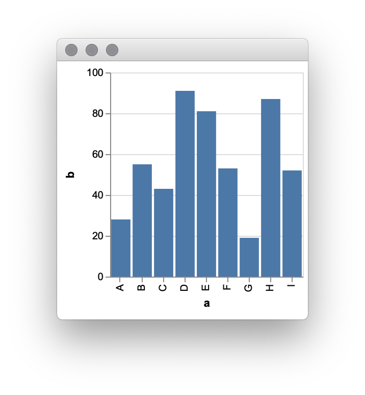

# vega.repl

[](https://circleci.com/gh/zane/vega.repl)

[Vega](https://vega.github.io/vega/) and [Vega-Lite](https://vega.github.io/vega-lite/) data visualization utilities meant to be used interactively at the REPL.

## Rationale

[Vega](https://vega.github.io/vega/) is a visualization grammar, a declarative language for creating, saving, and sharing interactive visualization designs. [Vega-Lite](https://vega.github.io/vega-lite/) provides a higher-level grammar for visual analysis, comparable to [ggplot](https://ggplot2.tidyverse.org/) or [Tableau](https://www.tableau.com/), that generates complete Vega specifications.

vega.repl aims to be the simplest possible way to go from Clojure data and a Vega or Vega-Lite spec to a rendered visualization. It is an alternative to larger, more complex libraries like [Oz](https://github.com/metasoarous/oz) and [Hanami](https://github.com/jsa-aerial/hanami).

## Installation

vega.repl has not yet had an official release. As of now it is only available as a [git dependency](https://clojure.org/guides/deps_and_cli#_using_git_libraries). Add the following to your `deps.edn`, replacing `...` with the [SHA of the commit](https://help.github.com/en/articles/github-glossary#commit) you would like to use.

```clojure
{:deps {zane/vega.repl {:git/url "https://github.com/zane/vega.repl" :sha "..."}}}
```

## Usage

Require `zane.vega.repl` and call `vega-lite` on your Vega-Lite spec.

```clojure
user=> (require '[zane.vega.repl :refer [vega-lite]])
nil
user=> (vega-lite {:$schema "https://vega.github.io/schema/vega-lite/v3.json"
                   :description "A simple bar chart with embedded data."
                   :data {:values [{:a "A" :b 28}
                                   {:a "B" :b 55}
                                   {:a "C" :b 43}
                                   {:a "D" :b 91}
                                   {:a "E" :b 81}
                                   {:a "F" :b 53}
                                   {:a "G" :b 19}
                                   {:a "H" :b 87}
                                   {:a "I" :b 52}]}
                   :mark "bar"
                   :encoding {:x {:field "a" :type "ordinal"}
                              :y {:field "b" :type "quantitative"}}})
```

A floating window will open with the rendered Vega-Lite visualization.



## License

Copyright © 2019 Zane Shelby

Released under the GNU General Public License.
